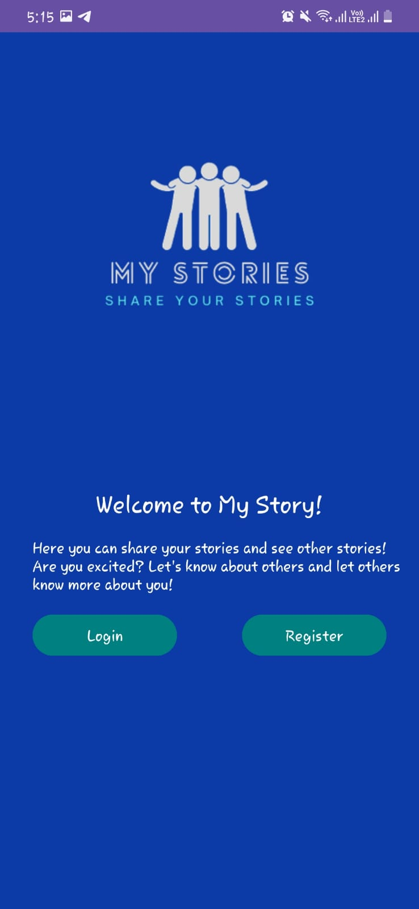
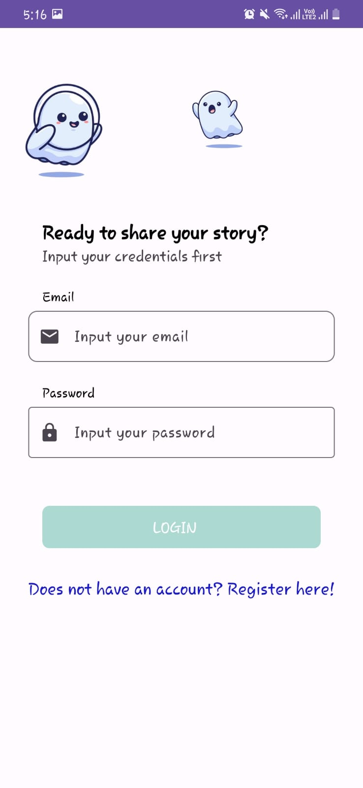
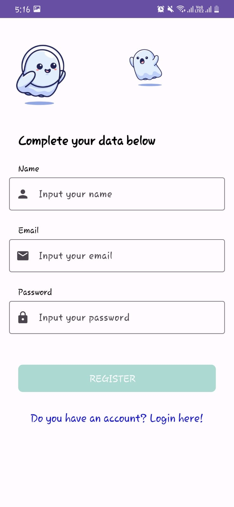
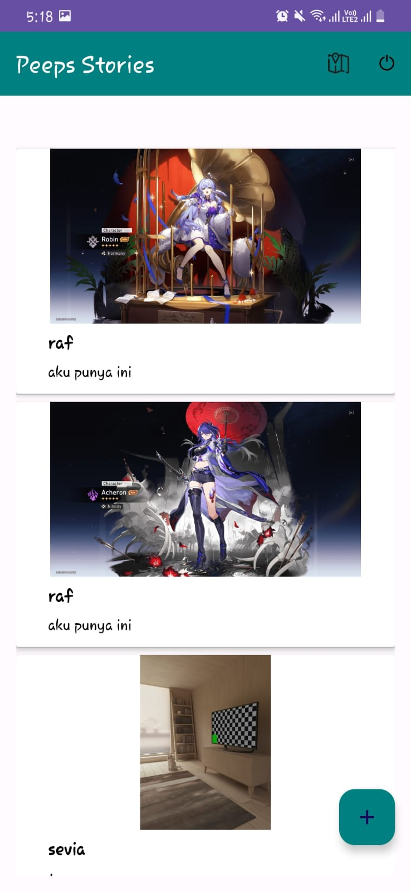
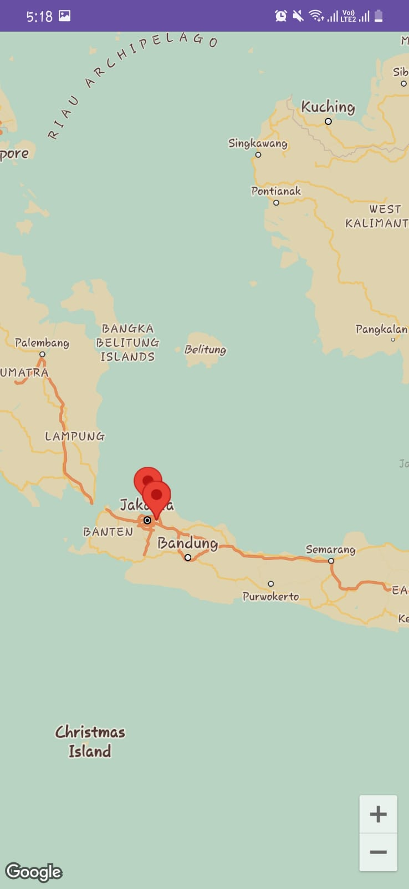
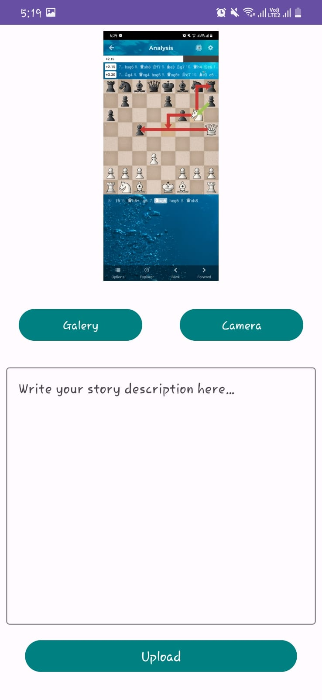
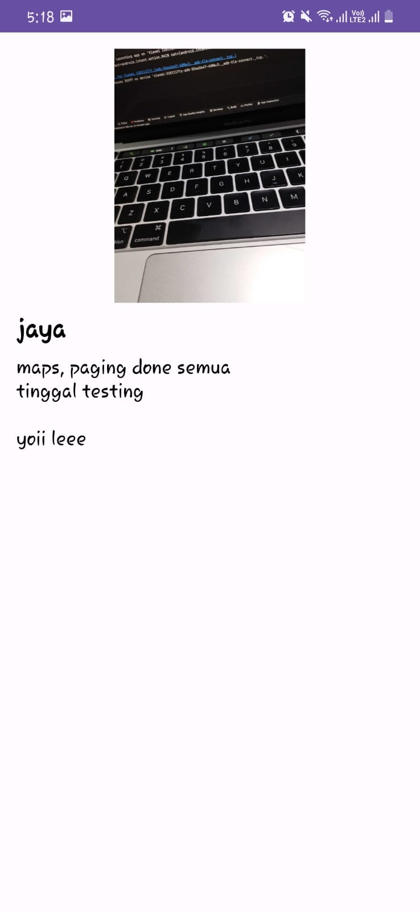

My Story App is an application for people to view other people's stories. Users can also add their own stories. For this initial submission, I used technologies such as animation, LiveData, Retrofit, custom views, localization, MVVM architecture, and more. The stories available in My Story App are limited to those provided by Dicoding Academy's API
# What I've done
- Implementing animation in Android
- Implementing maps using Googke Maps API
- Implementing Single Source of Truth
- Implementing pagination
- Implementing media camera from gallery and device camera
# Screenshot
- Landing Screen  
  
- Login Screen  
  
- Register Screen  
  
- Home Screen  
  
- Maps Screen  
  
- Upload Screen  
  
- Detail Screen  
  
